# soccer_hfa
A repository for exploring home field advantage (hfa) in soccer for matches played without fans due to the ongoing COVID-19 pandemic.

---

### Files

* __hfa_sims.R:__ Functions to simulate the distribution of expected home points, using both [FiveThirtyEight's Soccer model]("https://projects.fivethirtyeight.com/soccer-predictions/") (with 10% reduced hfa) as well as my own model which mimicks FiveThirtyEights model but can have variable hfa.
* __model_fit.R:__ Functions to fit model that allows for variable hfa.
* __prediction_helpers.R:__ Functions that translate predicted scoring rates ($\lambda_1$, $\lambda_2$) into (win, loss, draw) probabilities.
* __xg_graphics.R:__ Functions for plotting shot- and non-shot- based expected goals graphics.
* __pipeline.R__: Data pipeline to run all of the above scripts for a given league.

Each league has a folder which contains the following objects:

* __figures/:__ Graphics from simulations and xG analysis
* __model.rds:__ League specific model used in sims
* __simulations/:__
    * __sims.csv:__ csv with simulation results for expected points by hfa reduction between 0 - 100%
    * __simulation_ecdf.csv:__ csv w/ empirical P(simulated home points <= obsevered home points | hfa reduction)

---
 
More background on the methodolgy behind this analysis can be found [here](https://lukebenz.com/post/bundesliga_hfa/).

__Updates: 2020-06-11:__

* Add 95% CI to graphics

__Updates: 2020-06-09:__

* Refactor to take config file and add logos to graphics.

__Updates: 2020-06-04:__

* Change model to predict FiveThirtyEight $(\lambda_1, \lambda2)$ (rather than predict score directly) for better calibration in leagues with less training data.
* Inflate draw probabilities using FiveThirtyEight's __draw_inflation_factors.csv__ provided by [Jay Boice](https://fivethirtyeight.com/contributors/jay-boice/).

---

### Results (Updated 2020-07-02)

  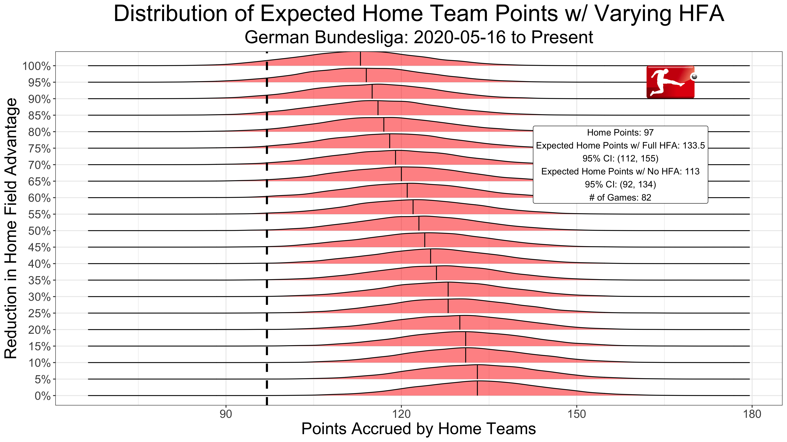
  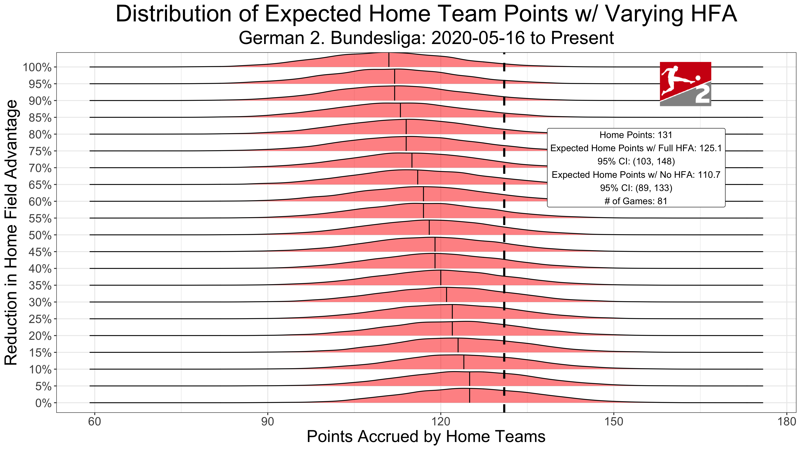
  
  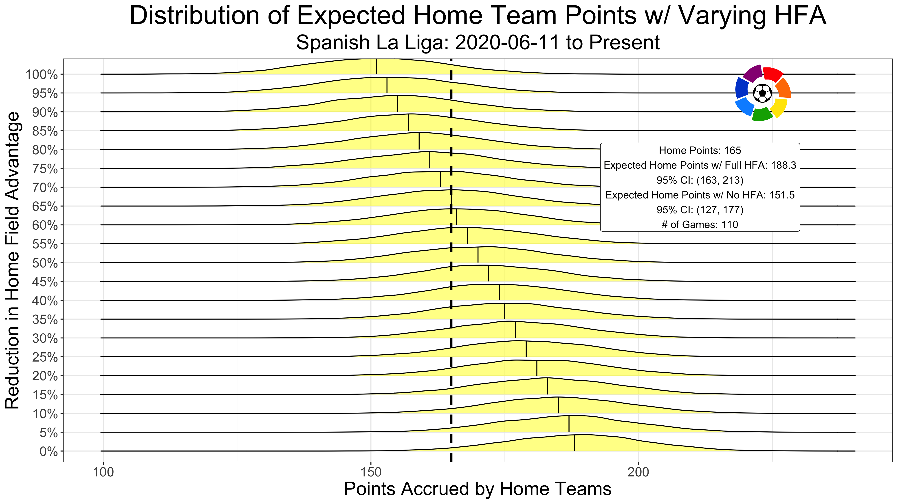
  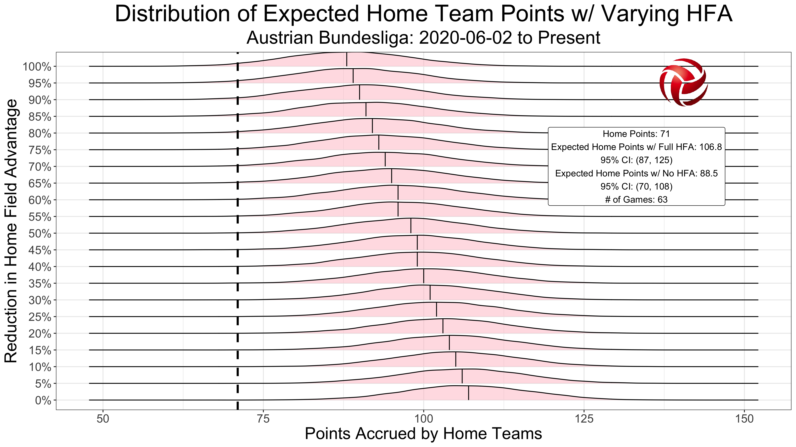
  
  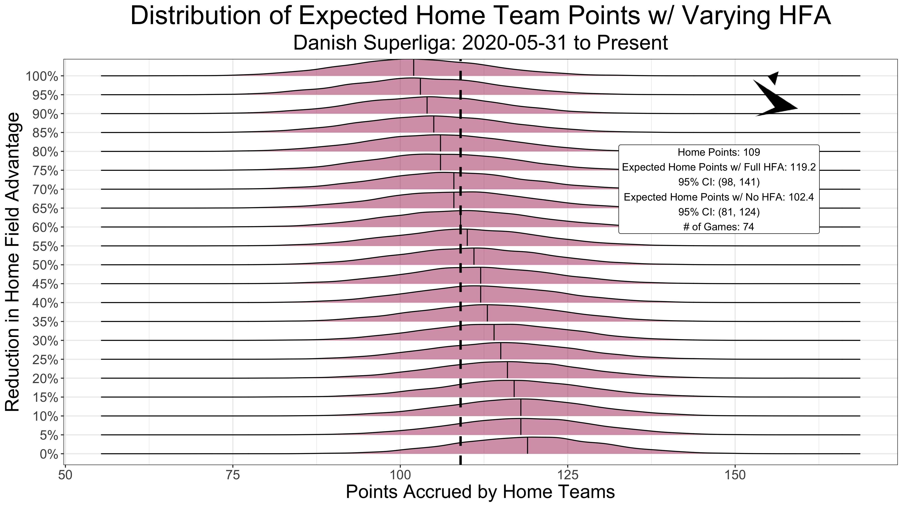
  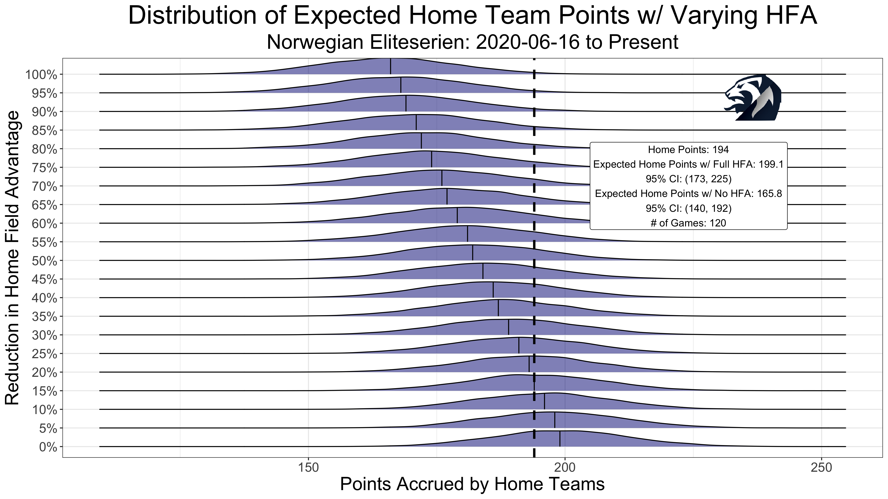
  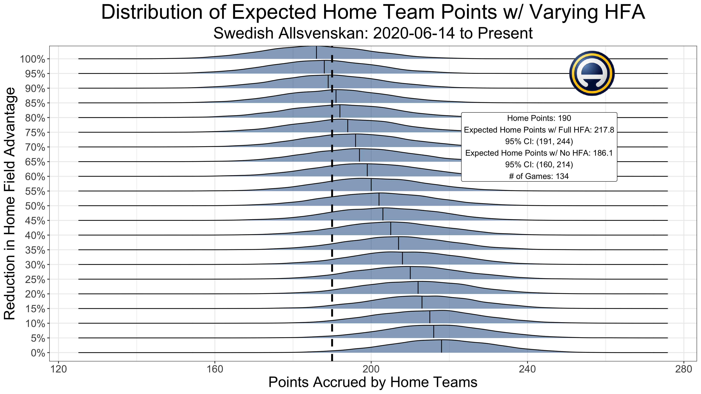
  
  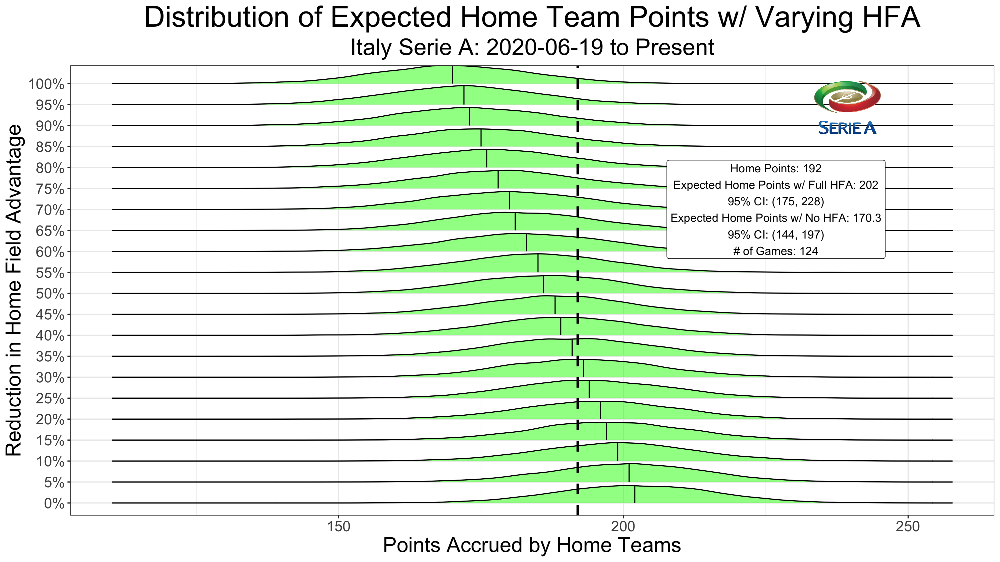
  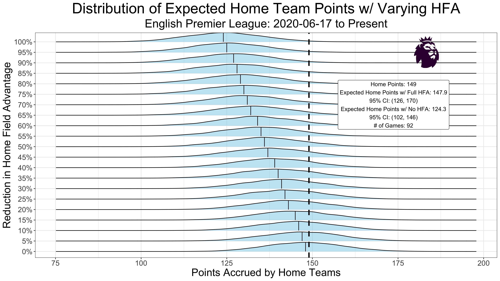
  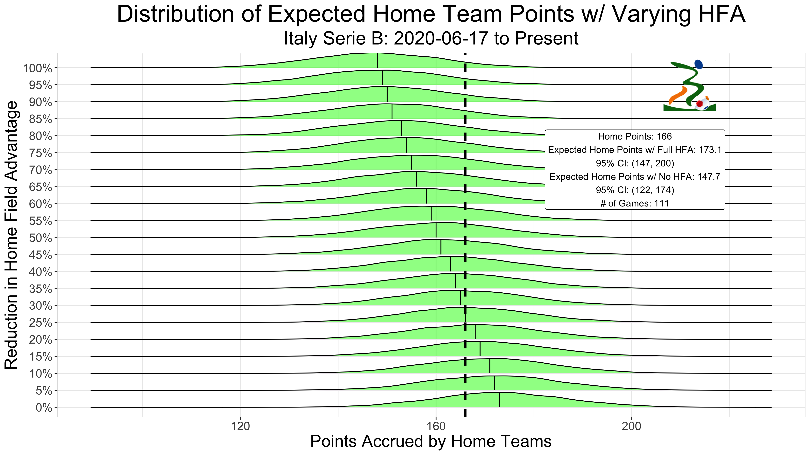
  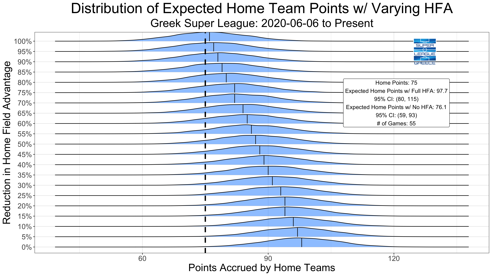
  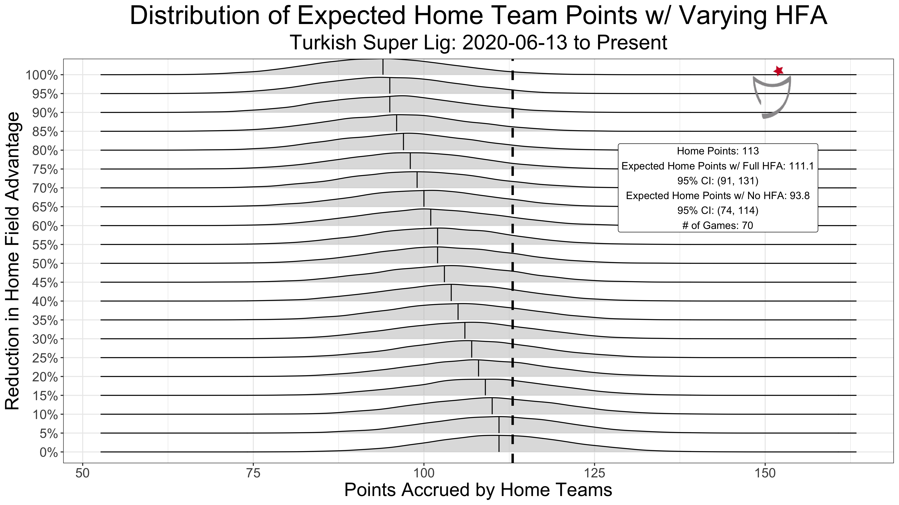
  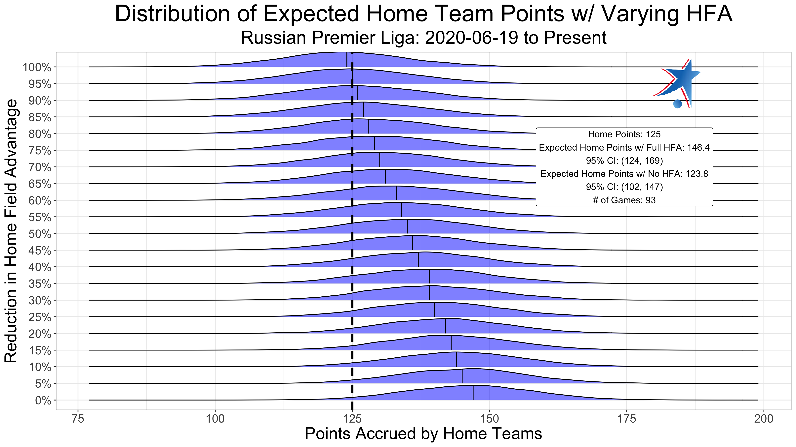
  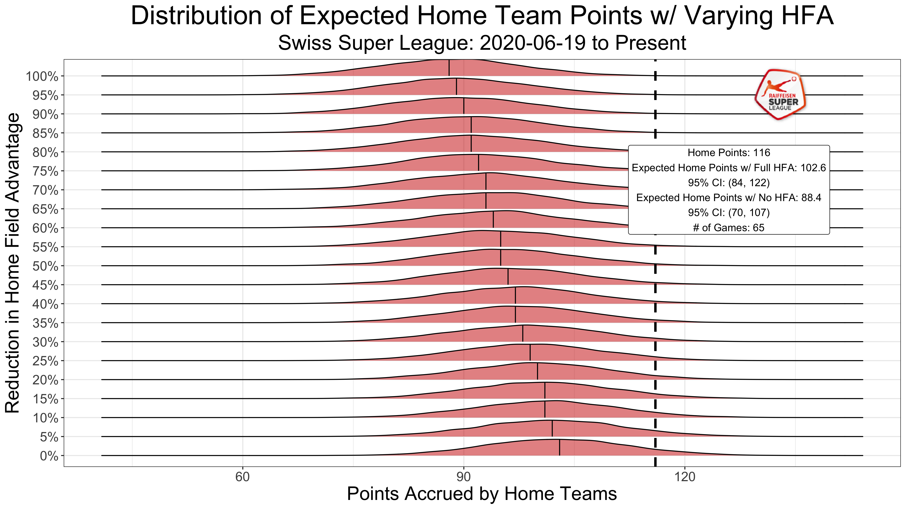

