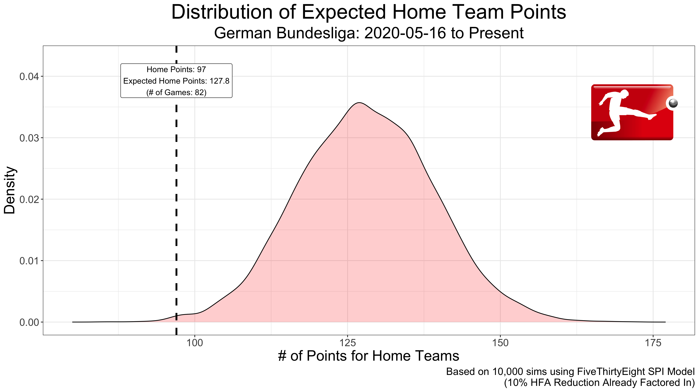

# soccer_hfa
A repository for exploring home field advantage (hfa) in soccer for matches played without fans due to the ongoing COVID-19 pandemic.

* __hfa_sims.R:__ Functions to simulate the distribution of expected home points, using both [FiveThirtyEight's Soccer model]("https://projects.fivethirtyeight.com/soccer-predictions/") (with 10% reduced hfa) as well as my own model which mimicks FiveThirtyEights model but can have variable hfa.
* __model_fit.R:__ Functions to fit model that allows for variable hfa.
* __prediction_helpers.R:__ Functions that translate predicted scoring rates ($\lambda_1$, $\lambda_2$) into (win, loss, draw) probabilities.
* __xg_graphics.R:__ Functions for plotting shot- and non-shot- based expected goals graphics.
* __pipeline.R__: Data pipeline to run all of the above scripts for a given league.

Currently, analysis is only available for the German Bundesliga but will soon be available for other leagues upon their returns from the COVID-19 break. More background on the methodolgy behind this analysis can be found [here](https://lukebenz.com/post/bundesliga_hfa/).

